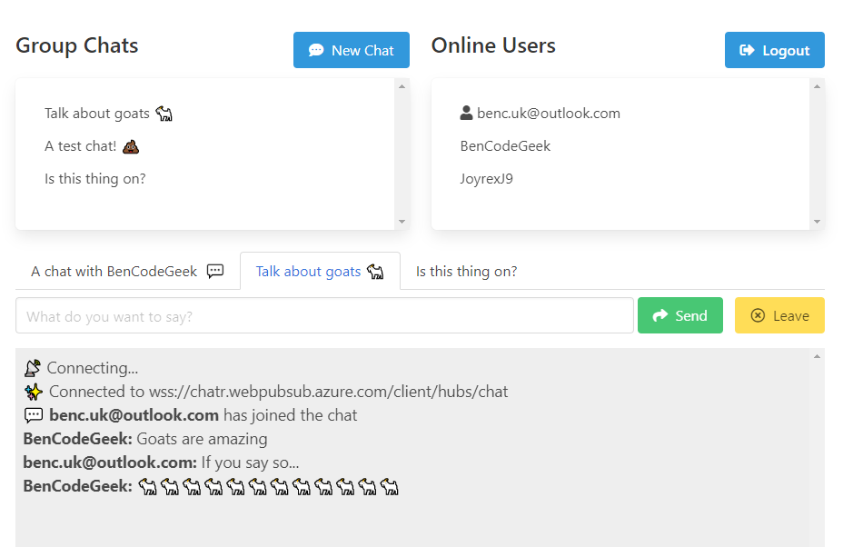
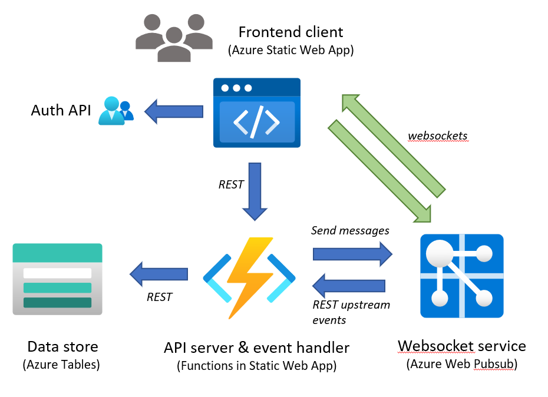

# Chatr - Azure Web PubSub Sample App

This is a demonstration & sample application designed to be a simple multi-user web based chat system.  
It provides group and private chats, a persistent user list and several other features.

It is built on several Azure technologies, including: _Web PubSub, Static Web Apps and \_Table Storage_

> 👁‍🗨 Note. This is a personal side project, created to aid learning while building something interesting. The code should not be considered 'best practice' or representing a set of recommendations for using Azure Web PubSub, however it does represent the output of getting something working!


Goals:

- Learn about using websockets
- Write a 'fun' thing
- Try out the new _Azure Web PubSub_ service
- Use the authentication features of _Azure Static Web Apps_
- Deploy everything using _Azure Bicep_

Use cases & key features:

- Sign-in with Microsoft, Twitter or GitHub accounts
- Realtime chat with users
- Shared group chats
- Private user to user chats

# Screenshot



# Architecture



# Client / Frontend

This is the part used by end users, and is the web frontend.

The source for this is found in **client/** and is a static standalone pure ES6 JS application, no bundling or Node.js is required. It is written using [Vue.js as a supporting framework](https://vuejs.org/), and [Bulma as a CSS framework](https://bulma.io/).

Some notes:

- ES6 modules are used so the various JS files can use import/export without the need to bundle.
- Vue.js is used as a browser side library loaded from CDN with `<script>` tag, this is an elegant & lightweight approach supported by modern browsers, rather than the usual vue-cli style app which requires Node and webpack etc.
- `client/js/app.js` shows how to create a Vue.js app with child components using this approach.
- `client/js/components/chat.js` is a Vue.js component used to host each chat tab in the application
- The special `.auth/` endpoint provided by Static Web Apps is used to sign users in and fetch their user details, such as userId.

# Server

This is the backend, handling websocket events to and from Azure Web PubSub, and providing REST API for some operations.

The source for this is found in **api/** and is a Node.js Function App. It connects to Azure Table Storage to persist group chat and user data (Table Storage was picked as it's simple & cheap). This is not hosted in a standalone Azure Function App but instead [deployed into the Static Web App as part of it's serverless API support](https://docs.microsoft.com/en-us/azure/static-web-apps/apis)

There are four functions:

- `eventHandler` - Webhook receiver for "upstream" events sent from Azure Web PubSub service, contains the majority of application logic. Not called by the client.
- `getToken` - Called by the client to get an access token and URL to connect via WebSockets to the Azure Web PubSub service.
- `getUsers` - Returns a list of signed in users, note the route for this function is `/api/users`
- `getChats` - Returns a list of active group chats, note the route for this function is `/api/chats`

## WebSocket & API Message Flows

There is two way message flow between clients and the server via [Azure Web PubSub and event handlers](https://azure.github.io/azure-webpubsub/concepts/service-internals#event-handler)

[The json.webpubsub.azure.v1 subprotocol is used](https://azure.github.io/azure-webpubsub/references/pubsub-websocket-subprotocol) rather than basic WebSockets, this provides a number of features: users can be added to groups, clients can send custom events (using `type: event`), and also send messages direct to other clients without going via the server (using `type: sendToGroup`)

Notes:

- Chat IDs are simply randomly generated GUIDs, these correspond to the names of "groups" in the subprotocol.
- Private chats are a special case, they are not persisted in state, and they do not trigger **chatCreated** events. Also the user doesn't issue a **joinChat** event to join them, that is handled by the server as a kind of "push" to the clients.
- User IDs are simply strings which are considered to be unique, this could be improved, e.g. with prefixing.

### Client Messaging

Chat messages sent from the client use `sendToGroup` and a custom JSON payload with two fields `message` and `user`, these messages are relayed client to client, the server is never notified of them:

```
{
  type: 'sendToGroup',
  group: <chatId>,
  dataType: 'json',
  data: {
    message: <message text>,
    user: <userId of sender>,
  },
}
```

Events from the the client are sent as `event` type messages using the _json.webpubsub.azure.v1_ protocol, the events sent are:

- **createChat** - Request the server you want to create a group chat
- **createPrivateChat** - Request the server you want to create a private chat
- **joinChat** - To join a chat, the server will add user to the group for that chatId
- **leaveChat** - To leave a group chat

The `eventHandler` function has cases for each of these user events, along with handlers for connection & disconnection system events.

### Server Messaging

Messages sent from the server have a custom Chatr app specific payload as follows:

```
{
  chatEvent: <eventType>,
  data: <JSON object type dependant>
}
```

Where eventType is one of:

- **chatCreated** - Let all users know a new group chat has been created
- **chatDeleted** - Let all users know a group chat has been removed
- **userOnline** - Let all users know a user has come online
- **userOffline** - Let all users know a user has left
- **joinPrivateChat** - Sent to both the initiator and recipient of a private chat

The client code in `client/js/app.js` handles these messages as they are received by the client, and reacts accordingly.

# Some Notes on Design and Service Choice

The plan of this project was to use _Azure Web PubSub_ and _Azure Static Web Apps_, and to host the server side component as a set of serverless functions in the _Static Web Apps_ API support (which is in fact _Azure Functions_ under the hood). _Azure Static Web Apps_ was selected because it has [amazing support for codeless and config-less user sign-in and auth](https://docs.microsoft.com/en-us/azure/static-web-apps/authentication-authorization), which I wanted to leverage.

Some comments on this approach:

- [API support in _Static Web Apps_ is quite limited](https://docs.microsoft.com/en-us/azure/static-web-apps/apis) and can't support the new bindings and triggers for Web PubSub. **HOWEVER** You don't need to use these bindings 😂. You can create a standard HTTP function to act as a webhook event handler instead of using the `webPubSubConnection` binding. For sending messages back to Web PubSub, the server SDK can simply be used within the function code rather than using the `webPubSub` output binding.
- Table Storage was picked for persisting state as it has a good JS SDK (the new SDK in @azure/data-table was used), it's extremely lightweight and cheap and was good enough for this project

# Running and Deploying the App

## Working Locally

See makefile

```text
$ make
help                 💬 This help message
lint                 🔎 Lint & format, will not fix but sets exit code on error
lint-fix             📜 Lint & format, will try to fix errors and modify code
run                  🏃 Run server locally using Static Web Apps CLI
clean                🧹 Clean up project
deploy               🚀 Deploy everything to Azure using Bicep
tunnel               🚇 Start loophole tunnel to expose localhost
```

## Deploying to Azure

Deployment is slightly complex due to the number of components and the configuration between them. The makefile target `deploy` should deploy everything for you in a single step using Bicep templates found in the **deploy/** folder

[See readme in deploy folder for details and instructions](./deploy)

## Running Locally

This is possible but it requires some juggling, and some amount of manual config

When running locally the Static Web Apps CLI is used and this provides a fake user authentication endpoint for us.

- Deploy _Azure Storage_ account, get name and access key.
- Deploy _Azure Web Pub Sub_, get connection string.
- Copy `api/local.settings.sample.json` to `api/local.settings.json` and edit the required setting values.
- Start local tunnel service such as **ngrok** or **loophole**. The tunnel should expose port 3000 over HTTP. I use [loophole](https://loophole.cloud/) as it allows me to set the hostname, e.g.
  - `loophole http 3000 --hostname chatr`
- In _Azure Web Pub Sub_ settings.
  - Add a hub named **chat**
  - In the URL template put `https://{{hostname-of-tunnel-service}}/api/eventHandler`
  - In system events tick **connected** and **disconnected**
- Run `make run`
- Open `http://localhost:4280/index.html`
