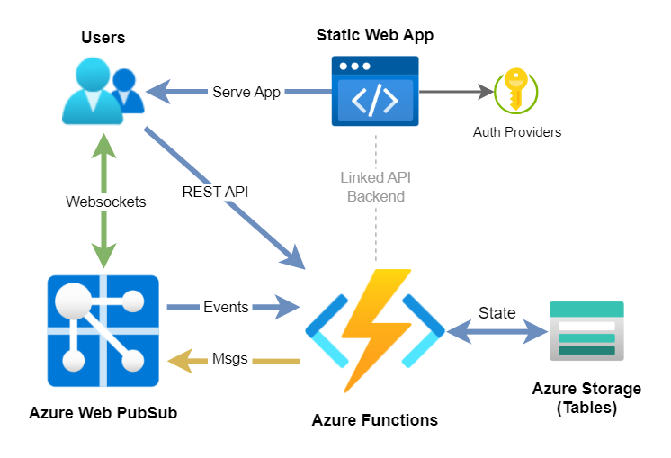

# Chatr - Azure Web PubSub Sample App

This is a demonstration & sample application designed to be a simple multi-user web based chat system.  
It provides persistent group chats, user to user private chats, a user list, idle (away from keyboard) detection and several other features.

It is built on several Azure technologies, including: _Web PubSub, Functions, Static Web Apps_ and _Table Storage_

> 👀 Note. This was created as a personal project, created to aid learning while building something interesting. The code comes with all the caveats you might expect from such a project.


Goals:

- Learn about using websockets
- Write a 'fun' thing
- Try out the new _Azure Web PubSub_ service
- Use the authentication features of _Azure Static Web Apps_
- Deploy everything using _Azure Bicep_
- No connection strings, managed identity for everything

Use cases & key features:

- Sign-in with Microsoft, Twitter or GitHub accounts
- Realtime chat with users
- Shared group chats, only the creator can remove the chat
- Detects where users are idle and away from keyboard (default is one minute)
- Private 'user to user' chats, with notifications and popups

# Screenshot


# Architecture



# Client / Frontend

This is the main web frontend as used by end users via the browser.

The source for this is found in **client/** and consists of a static standalone pure ES6 JS application, no bundling or Node.js is required. It is written using [Vue.js as a supporting framework](https://vuejs.org/), and [Bulma as a CSS framework](https://bulma.io/).

Some notes:

- Vue.js is used as a browser side library loaded from CDN as a ESM module, this is an elegant & lightweight approach supported by modern browsers, rather than the usual style of SPA app which requires Node and webpack etc.
- No bundling/build. ES6 modules are used so the various JS files can use import/export without the need to bundle.
- `client/js/app.js` shows how to create a Vue.js app with child components using this approach. The majority of client logic is here.
- `client/js/components/chat.js` is a Vue.js component used to host each chat tab in the application
- The special `.auth/` endpoint provided by Static Web Apps is used to sign users in and fetch their user details, such as userId.

# Server

This is the backend, handling websocket events to and from Azure Web PubSub, and providing REST API for some operations.

The source for this is found in **api/** and consists of a Node.js Azure Function App using the v4 programming model. It connects to Azure Table Storage to persist group chat and user data (Table Storage was picked as it's simple & cheap). This is not hosted in a standalone Azure Function App but instead [deployed into the Static Web App as part of it's serverless API support](https://docs.microsoft.com/en-us/azure/static-web-apps/apis)

There are four HTTP functions all served from the default `/api/` path

- `eventHandler` - Webhook receiver for "upstream" events sent from Azure Web PubSub service, contains the majority of application logic. Not called directly by the client, only Azure WebPub Sub.
- `getToken` - Called by the client to get an access token and URL to connect via WebSockets to the Azure Web PubSub service. Must be called with userId in the URL query, e.g. GET `/api/getToken?userId={user}`
- `users` - Returns a list of signed in users from state
- `chats` - Returns a list of active group chats from state

State is handled with `state.js` which is an ES6 module exporting functions supporting state CRUD for users and chats. This module carries out all the interaction with Azure Tables, and provides a relatively transparent interface, so a different storage backend could be swapped in.

## WebSocket & API Message Flows

There is two way message flow between clients and the server via [Azure Web PubSub and event handlers](https://learn.microsoft.com/en-gb/azure/azure-web-pubsub/howto-develop-eventhandler)

[The json.webpubsub.azure.v1 subprotocol is used](https://learn.microsoft.com/en-gb/azure/azure-web-pubsub/reference-json-webpubsub-subprotocol) rather than basic WebSockets, this provides a number of features: users can be added to groups, clients can send custom events (using `type: event`), and also send messages direct to other clients without going via the server (using `type: sendToGroup`)

Notes:

- Chat IDs are simply randomly generated GUIDs, and these correspond 1:1 with "groups" in the subprotocol.
- Private chats are a special case, they are not persisted in state, and they do not trigger **chatCreated** events. Also the user doesn't issue a **joinChat** event to join them, that is handled by the server as a kind of "push" to the clients.
- User IDs are simply strings which are considered to be unique, this could be improved, e.g. with prefixing.

### Client Messaging

Events & chat are sent using the _json.webpubsub.azure.v1_ subprotocol

Chat messages sent from the client use `sendToGroup` and a custom JSON payload with three fields `message`, `fromUserId` & `fromUserName`, these messages are relayed client to client by Azure Web PubSub, the server is never notified of them:

```go
{
  type: 'sendToGroup',
  group: <chatId>,
  dataType: 'json',
  data: {
    message: <message text>,
    fromUserId: <userId>,
    fromUserName: <userName>,
  },
}
```

Events destined for the backend server are sent as WebSocket messages from the client via the same subprotocol with the `event` type, and an application specific sub-type, e.g.

```go
{
  type: 'event',
  event: 'joinChat',
  dataType: 'text',
  data: <chatId>,
}
```

The types of events are:

- **createChat** - Request the server you want to create a group chat
- **createPrivateChat** - Request the server you want to create a private chat
- **joinChat** - To join a chat, the server will add user to the group for that chatId
- **leaveChat** - To leave a group chat
- **deleteChat** - Called from a chat owner to delete a chat
- **userEnterIdle** - Let the server know user is now idle
- **userExitIdle** - Let the server know user is no longer idle

The backend API `eventHandler` function has cases for each of these user events, along with handlers for connection & disconnection system events.

### Server Messaging

Messages sent from the server have a custom Chatr app specific payload as follows:

```go
{
  chatEvent: <eventType>,
  data: <JSON object type dependant>
}
```

Where `eventType` is one of:

- **chatCreated** - Let all users know a new group chat has been created
- **chatDeleted** - Let all users know a group chat has been removed
- **userOnline** - Let all users know a user has come online
- **userOffline** - Let all users know a user has left
- **joinPrivateChat** - Sent to both the initiator and recipient of a private chat
- **userIsIdle** - Sent to all users when a user enters idle state
- **userNotIdle** - Sent to all users when a user exits idle state

The client code in `client/js/app.js` handles these messages as they are received by the client, and reacts accordingly.

# Some Notes on Design and Service Choice

The plan of this project was to use _Azure Web PubSub_ and _Azure Static Web Apps_, and to host the server side component as a set of serverless HTTP functions in _Azure Functions_. _Azure Static Web Apps_ was selected because it has [amazing support for codeless and config-less user sign-in and auth](https://docs.microsoft.com/en-us/azure/static-web-apps/authentication-authorization), which I wanted to leverage.

Some comments on this approach:

- New: Originally the fully managed API support in Static Web Apps was used, however as the project switched to using managed identity for everything, a side effect of this was a need to move to a standalone external Function App, [as managed identity is not supported in managed mode](https://learn.microsoft.com/en-gb/azure/static-web-apps/apis-functions).
- A decision was made to create a HTTP function to act as a webhook event handler instead of using the provided `webPubSubConnection` binding. This is partly historical now (see above bullet), but it sill remains a valid approach. For sending messages back to Web PubSub, the server SDK can simply be used within the function code rather than using the `webPubSub` output binding.
- Table Storage was picked for persisting state as it has a good JS SDK (the new SDK in @azure/data-table was used), it's extremely lightweight and cheap and was good enough for this project, see details below

# State & Entity Design

State in Azure Tables consists of two tables (collections) named `chats` and `users`

### Chats Table

As each chat contains nested objects inside the members field, each chat is stored as a JSON string in a field called `data`. The PartitionKey is not used and hardcoded to a string "chatr". The RowKey and the id field inside the data object are the same.

- **PartitionKey**: "chatr"
- **RowKey**: The chatId (random GUID created client side)
- **data**: JSON stringified chat entity

Example of a chat data entity

```json
{
  "id": "eab4b030-1a3d-499a-bd89-191578395910",
  "name": "This is a group chat",
  "members": {
    "0987654321": {
      "userId": "0987654321",
      "userName": "Another Guy"
    },
    "1234567890": {
      "userId": "1234567890",
      "userName": "Ben"
    }
  },
  "owner": "1234567890"
}
```

### Users Table

Users are stored as entities with the fields (columns) described below. As there are no nested fields, there is no need to encode as a JSON string. Again the PartitionKey is not used and hardcoded to a string "chatr".

- **PartitionKey**: "chatr"
- **RowKey**: The `userId` field returned from Static Web Apps auth endpoint
- **userName**: The username (could be email address or handle) of the user
- **userProvider**: Which auth provided the user signed in with `twitter`, `aad` or `github`
- **idle**: Boolean, indicating if the user us currently idle

# Running and Deploying the App

## Working Locally

See makefile

```text
$ make
help                 💬 This help message
lint                 🔎 Lint & format, will not fix but sets exit code on error
lint-fix             📜 Lint & format, will try to fix errors and modify code
run                  🏃 Run server locally using SWA CLI
clean                🧹 Clean up project
deploy-infra         🚀 Deploy required infra in Azure using Bicep
deploy-api           🚀 Deploy API to Azure using Function Core Tools
deploy-client        🚀 Deploy client to Azure using SWA CLI
deploy               🚀 Deploy everything!
tunnel               🚇 Start AWPS local tunnel tool for local development
```

## Deploying to Azure

Deployment is slightly complex due to the number of components and the configuration between them. The makefile target `deploy` should deploy everything for you in a single step using Bicep templates found in the **deploy/** folder

[See readme in deploy folder for details and instructions](./deploy)

## Running Locally

This requires a little effort as the Azure Web PubSub service needs to be able call the HTTP endpoint on your location machine, plus several role assignments & configurations needs to happen, see below. The fabulous Azure Web PubSub local tunnel tool does a great job of providing a way to create a tunnel.

When running locally the Static Web Apps CLI is used and this provides a nice fake user authentication endpoint for us.

### Pre-Reqs

If these pre-reqs look a little daunting, don't worry, just use the dev container in the repo, this has everything you need to run and deploy the app.

- Linux / MacOS / WSL with bash make etc
- Node.js & npm
- [Static Web Apps CLI](https://azure.github.io/static-web-apps-cli/)
- [Azure Web PubSub local tunnel tool](https://learn.microsoft.com/en-gb/azure/azure-web-pubsub/howto-web-pubsub-tunnel-tool?tabs=bash)
- _Optional, deployment only_: [Azure CLI](https://learn.microsoft.com/en-us/cli/azure/install-azure-cli)
- _Optional, deployment only_: [Function Core Tools](https://learn.microsoft.com/en-us/azure/azure-functions/functions-run-local)

### Summary

A short summary of the steps to getting it running:

- Deploy an _Azure Storage_ account, ensure it has public access.
- Deploy an _Azure Web Pub Sub_ instance into the same resource group, also ensure it has public access.
- Role assignments:
  - Assign yourself the 'Web PubSub Service Owner' role on the Web Pub Sub resource
  - Assign yourself the 'Storage Table Data Contributor' role on the Storage Account
- Copy `api/local.settings.sample.json` to `api/local.settings.json` and edit the required settings values.
- In _Azure Web Pub Sub_ settings. Go into the 'Settings' section
  - Add a hub named **"chat"**
  - Add an event handler:
    - In 'URL Template Type' select "Tunnel traffic to local"
    - For the URL template add **"api/eventHandler"**
    - Under system events tick **connected** and **disconnected**
    - Leave everything else alone :)
- Check the values at the top of the `makefile`
  - `AZURE_PREFIX` should be the name of the _Azure Web Pub Sub_ resource
  - `AZURE_RESGRP` should be the resource group you deployed into
  - Rather than edit the `makefile` you can pass these values in after the make command or set them as env vars.
- Run `make run`
- Open a second terminal/shell and run `make tunnel`
- Open `http://localhost:4280/`

# Known Issues

- Won't run in Firefox as top level await is not yet supported
